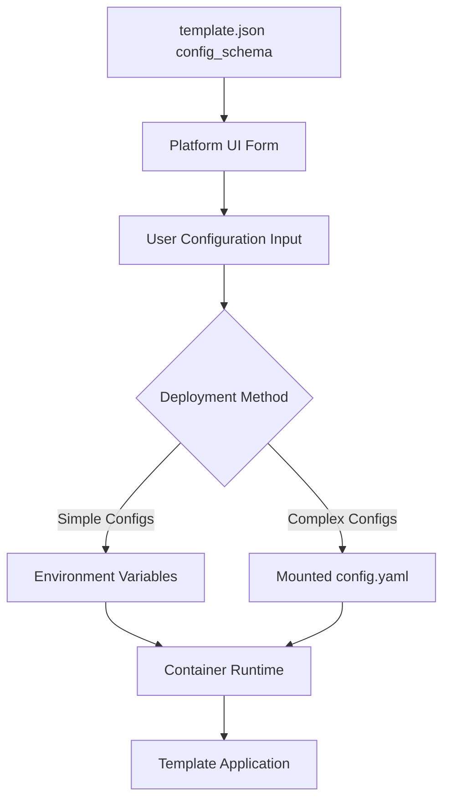

# MCP Template Configuration Strategy Analysis

## Current State Analysis

The file-server template currently implements a hybrid configuration approach:

### 1. Environment Variables (Primary)
- **Pros**: Docker-native, simple deployment, 12-factor app compliant
- **Cons**: Limited data types, not ideal for complex nested config
- **Current Implementation**: 
  ```javascript
  allowedDirs: process.env.MCP_ALLOWED_DIRS?.split(':') || ['/data'],
  readOnly: process.env.MCP_READ_ONLY === 'true',
  excludePatterns: process.env.MCP_EXCLUDE_PATTERNS?.split(',') || [...]
  ```

### 2. Config File Fallback
- **Location**: `/app/config/file-server.json`
- **Pros**: Supports complex nested configuration, versioning, validation
- **Cons**: Requires volume mounting, more complex deployment
- **Current Implementation**: Loaded after env vars, overrides defaults

### 3. Template Schema Definition
- **Location**: `template.json` - `config_schema` section
- **Purpose**: Defines UI form fields and validation rules
- **Gap**: Not fully mapped to actual configuration options

## Configuration Gaps Identified

Comparing `template.json` config_schema vs actual implementation:

| Template Schema Field | Env Variable | Config File | Implemented |
|----------------------|-------------|-------------|-------------|
| `allowed_directories` | `MCP_ALLOWED_DIRS` | `allowedDirs` | ✅ |
| `read_only_mode` | `MCP_READ_ONLY` | `readOnly` | ✅ |
| `enable_symlinks` | `MCP_ENABLE_SYMLINKS` | `enableSymlinks` | ✅ |
| `max_file_size` | `MCP_MAX_FILE_SIZE` | `maxFileSize` | ✅ |
| `exclude_patterns` | `MCP_EXCLUDE_PATTERNS` | `excludePatterns` | ✅ |
| **Missing from config.json:** | | | |
| `security.maxFileSize` | ❌ | ❌ | Partial |
| `logging.level` | `LOG_LEVEL` | ❌ | ✅ |
| `logging.enableAudit` | ❌ | ❌ | ❌ |
| `logging.logFile` | ❌ | ❌ | Hardcoded |
| `performance.*` | ❌ | ❌ | ❌ |
| `monitoring.*` | ❌ | ❌ | ❌ |
| `platform.*` | ❌ | ❌ | ❌ |

## Recommended Scalable Strategy

### Hybrid Configuration with Enhanced Mapping



### Implementation Plan

#### 1. Standardize Configuration Mapping

Create a configuration mapping system that ensures `template.json` schema matches actual implementation:

```json
{
  "config_schema": {
    "properties": {
      "allowed_directories": {
        "type": "array",
        "env_mapping": "MCP_ALLOWED_DIRS",
        "config_path": "security.allowedDirs",
        "transform": "array_to_colon_separated"
      }
    }
  }
}
```

#### 2. Enhanced Configuration Loading

```javascript
class ConfigurationManager {
  constructor() {
    this.config = this.loadConfiguration();
  }

  loadConfiguration() {
    // 1. Load defaults from template schema
    const defaults = this.loadDefaultsFromSchema();
    
    // 2. Override with environment variables
    const envConfig = this.loadFromEnvironment();
    
    // 3. Override with config file if present
    const fileConfig = this.loadFromFile('/app/config/config.yaml');
    
    // 4. Merge with precedence: file > env > defaults
    return deepMerge(defaults, envConfig, fileConfig);
  }
}
```

#### 3. Configuration Generation in Deployment Service

```python
def generate_container_config(self, template_data: Dict, user_config: Dict):
    """Generate container configuration based on complexity"""
    simple_configs = []
    complex_configs = {}
    
    for key, value in user_config.items():
        schema_field = template_data['config_schema']['properties'].get(key, {})
        
        if self.is_simple_config(schema_field, value):
            # Use environment variable
            env_name = schema_field.get('env_mapping', f'MCP_{key.upper()}')
            simple_configs.append(f"--env={env_name}={value}")
        else:
            # Add to config file
            config_path = schema_field.get('config_path', key)
            self.set_nested_value(complex_configs, config_path, value)
    
    return {
        'env_vars': simple_configs,
        'config_file': complex_configs if complex_configs else None
    }
```

## Configuration Strategy Recommendations

### 1. **Environment Variables for Simple Configs** ✅
- **Use For**: Strings, numbers, booleans, simple arrays
- **Standardize Naming**: `MCP_*` prefix for all template configs
- **Examples**: `MCP_READ_ONLY`, `MCP_MAX_FILE_SIZE`, `MCP_ALLOWED_DIRS`

### 2. **YAML Config Files for Complex Configs** ✅
- **Use For**: Nested objects, complex arrays, conditional logic
- **Location**: `/app/config/config.yaml`
- **Mount Strategy**: Create temp config file, mount as volume
- **Examples**: Performance settings, monitoring thresholds, complex security rules

### 3. **Template Schema as Source of Truth** ✅
- **Extend template.json**: Add mapping metadata for each field
- **Validation**: Use schema for both UI generation and runtime validation
- **Documentation**: Auto-generate docs from schema

### 4. **Deployment Intelligence** ✅
- **Auto-detect**: Simple vs complex configurations
- **Fallback**: Environment variables as primary, config file as override
- **Flexibility**: Support both methods simultaneously

## Implementation Priority

1. **Phase 1** (Immediate): Fix missing environment variable mappings
2. **Phase 2**: Implement YAML config file support for complex settings
3. **Phase 3**: Add schema-driven configuration mapping
4. **Phase 4**: Auto-generate documentation and validation

## Benefits of This Approach

1. **Scalability**: Handles simple to complex configurations
2. **Developer Experience**: Clear schema-driven development
3. **Deployment Flexibility**: Supports various orchestration needs
4. **Backward Compatibility**: Maintains existing environment variable support
5. **Documentation**: Self-documenting through schema
6. **Validation**: Consistent validation across UI and runtime
